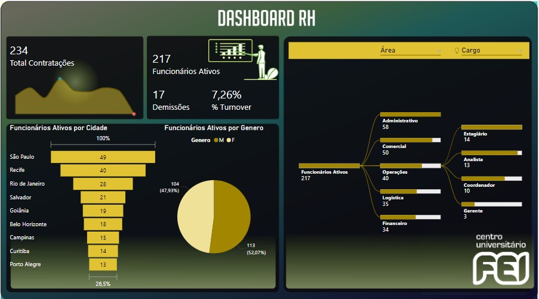
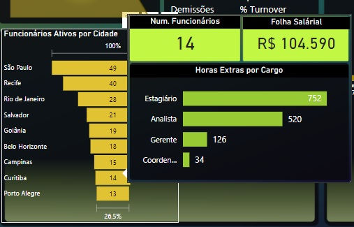

# Dashboard Controle Logistica
## 1. Problema de Negócio
O setor de RH da empresa, com foco no gerenciamento de colaboradores da empresa, solicitou um dashboard para acompanhamento de métricas que possam ajuda-los a entender melhor a situação atual de colaboradores da empresa auxiliando também na tomada de melhores decisões. 
- Algumas das métricas são: Folha Salarial, Funcionários Ativos, Total de Demissões, Funcionários por área, Funcionários por Cidade, Total de colaboradores, entre outros.

## 2. Estratégia da Solução
- Planejada uma análise descritiva como suficiente para atender ao problema de negócio.
- Foi desenvolvido um dashbord agrupando as métricas de colaboradores por setor, cidade e gênero.
- Também foi uma adicionada uma dica de ferramenta para visualização de informações específicas do agrupamento de preferência, sendo possível visualizar tanto no gráfico por Cidade quanto por gênero.

### 2.1 Imagem do Dashboard

### 2.2 Dicas de Ferramenta
- Dica de ferrmaneta adicionada.

## 3. Tecnologias usadas
- **Excel:** Recebimento da base de dados original;
- **Power BI:** Tratamento de dados, construção de tabelas métricas e dashboard.

## 4. Como executar o projeto
- Acesse o arquivo "Controle_RH.pbix";
- Utilize os filtros e gráfico interativos para visualização das métricas.

## 5. Top 3 Insights de dados
- Na visão geral da empresa o percentual de turnover de funcionários foi de 7,26%, tendo um número maior de demissões em São Paulo.
  - Sugestão: Realizar uma **análise diganóstica** buscando correlacionar as demissões com métricas como setor, data, cargo e identificar a possível causa das demissões.
- O resultado final permite que a equipe tenha visualização de métricas importantes relacionadas as partes:
  - Financeiro: Folha Salárial;
  - Políticas de igualdade: Visualização de funcionários agrupados por gênero;
  - Crescimento da empresa: Visualização temporal de total de contratações.
- Com exceção do setor de *Logística*, todos os setores tem mais funcionários no cargo de *Estagiário*.

## 6. Próximos Passos
1. Automatização do dashboard após novo recebimento de dados
2. Realizar uma análise diagnóstica para estudo dos insights sugeridos no item 5 e outras solicitações da equipe de RH
